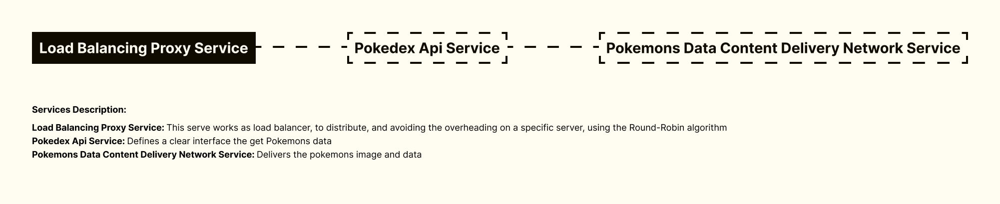

<h1 align="center">
Pokedex API With Elixir, PHP, Python, Laravel, Phoenix, FastAPI, Uvicorn, Asyncio, Unittest, PHP Unit, Docker
</h1>

 

 

  <a href="#description">✍️ Description</a> &nbsp;&nbsp;&nbsp;|&nbsp;&nbsp;&nbsp <a href="#endpoints">📌  Endpoints</a> &nbsp;&nbsp;&nbsp;|&nbsp;&nbsp;&nbsp <a href="#topology">🗺️  Topology</a> &nbsp;&nbsp;&nbsp;|&nbsp;&nbsp;&nbsp <a href="#install">🔍 Install</a> &nbsp;&nbsp;&nbsp;|&nbsp;&nbsp;&nbsp <a href="#technologies">🚀 Technologies</a> &nbsp;&nbsp;&nbsp;|&nbsp;&nbsp;&nbsp <a href="#related">♟️ Related</a> &nbsp;&nbsp;&nbsp;|&nbsp;&nbsp;&nbsp <a href="#contact">✉️ Contact</a>

 
 

<h3 id="description">✍️ Description:</h3>

It is usual to see a bunch of Pokedex APIs out here, but what are interesting is: how scalable this source code is, you can have thousands of request with this load balanced service in the shape it currently is; and the amount of languages this whole project was programmed in. I do like to respect te propose of the languages I do work on, and writing an API that uses Laravel to build a code that is easy to maintain, Elixir to handle a heavy load and FastAPI to create a fancy CDN was pleasureful to program.

 

<h3 id="endpoints">📌  Endpoints:</h3>

<image src="./service_endpoints.png" width="100%"/>

 

<h3 id="topology">🗺️  Topology:</h3>

 

<h3 id="install">🔍  Install:</h3>

To start the service, run the following commands:

**To run the service:**

`./service_starting.sh`

 

<h3 id="technologies">🚀  Technologies:</h3>

To build this project is used:

- Elixir
- PHP
- Python
- FastAPI
- Uvicorn
- Starlette
- Python Unittest
- Python Asyncio
- Docker
- Docker Compose
- Laravel
- PHP Unit
- Guzzle
- Elixir Phoenix
- Sqlite3
- Elixir Ecto

 

<h3 id="related">♟️  Related:</h3>

See more:

<ul>
  <li><a href="https://github.com/samueldecarvalhodeveloper/Calculator-App-With-Jetpack-Compose-Kotlin-Material-3-JUnit-Mockk-Dagger-2-Coroutines-Ui-Automator">Calculator App With Jetpack Compose</a></li>
  <li><a href="https://github.com/samueldecarvalhodeveloper/Calculator-App-With-React-Native-Expo-Custom-Hooks-Typescript-Async-Storage-Prettier-Eslint">Calculator App With React Native</a></li>
  <li><a href="https://github.com/samueldecarvalhodeveloper/Matrix-Multiplication-Algorithm-With-Haskell-Cabal-Docker-Compose-EditorConfig-Fuctional-Programming">Matrix Multiplication With OCaml</a></li>
</ul>

 

<h3 id="contact">✉️  Contact:</h3>

**Email:**
<a href="mailto:personal.samuelcarvalho@gmail.com">personal.samuelcarvalho@gmail.com</a>

 
 

<strong>Repository Link:</strong>

[https://github.com/samueldecarvalhodeveloper/Pokedex-API-With-Elixir-PHP-Python-Laravel-Phoenix-FastAPI-Uvicorn-Asyncio-Unittest-PHP-Unit-Docker](https://github.com/samueldecarvalhodeveloper/Pokedex-API-With-Elixir-PHP-Python-Laravel-Phoenix-FastAPI-Uvicorn-Asyncio-Unittest-PHP-Unit-Docker)
